# Plot Types

MPP can generate 15 types of plots, all accessible through both the CLI (`-p <plot>`) and
the Python API (`mpp.plot.<method>(out)`).

All examples below use the HP35 villin headpiece dataset (35 residues, 12 macrostates,
`T none` lumping unless noted otherwise).

---

## Dendrogram

**What it shows:** The complete lumping tree. The y-axis is the metastability
\(T_{ii}\) (self-transition probability) of the state being merged at each step.
Branch colors encode the mean fraction of native contacts \(q\) of the merged
cluster. The bottom panel shows the final macrostate assignment as a color-coded bar
for each microstate, with macrostate labels. A good lumping produces clearly
separated color blocks.

**CLI:**
```bash
python -m MPP.run config.yml T none -Z Z.npy -p dendrogram -o dendrogram.pdf
```

**API:**
```python
mpp.plot.dendrogram("dendrogram.pdf")
```

**Example (HP35, `T none`, 12 macrostates):**

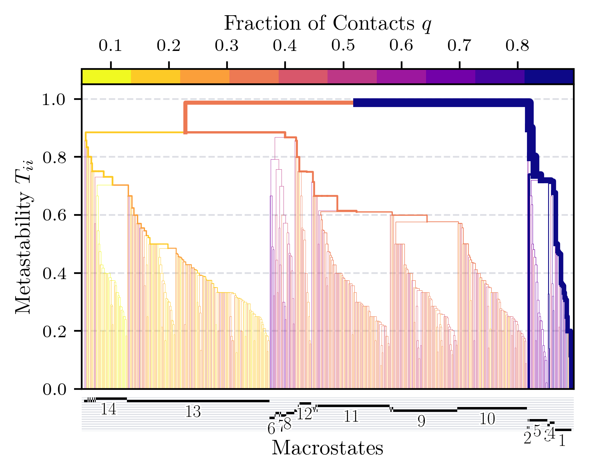

---

## Implied Timescales

**What it shows:** Implied timescales (ITS) of the macrostate model (solid lines)
as a function of lag time on a log–log scale. Each color corresponds to one
slowness-ranked timescale. A shaded region marks timescales below the analysis
lag time. Timescales that are flat with respect to lag time support the Markov
assumption.

The reference lines (dashed or dotted) depend on the `use_ref` option:

- **`use_ref=False`** (default for the `T none` reference lumping): the dashed
  lines show the implied timescales of the **microstate trajectory** directly.
  This is the standard way to assess how well the lumping preserves the slow
  dynamics of the underlying MD model.
- **`use_ref=True`** (useful for alternative lumpings such as `KL none`): the
  dotted lines show the implied timescales of the **`T none` macrostate model**.
  This allows a direct comparison between the alternative lumping and the
  reference lumping.

**CLI:**
```bash
python -m MPP.run config.yml T none -Z Z.npy -p timescales -o timescales.pdf
```

**API:**
```python
mpp.calc_timescales(ntimescales=3)
# use_ref=False: reference lines = microstate ITS (default for T/none)
mpp.plot.implied_timescales("timescales.pdf", use_ref=False, scale=0.5)
# use_ref=True: reference lines = T/none macrostate ITS (for alternative lumpings)
mpp.plot.implied_timescales("timescales.pdf", use_ref=True, scale=0.5)
```

**Example — `T none` with microstate ITS as reference (`use_ref=False`):**

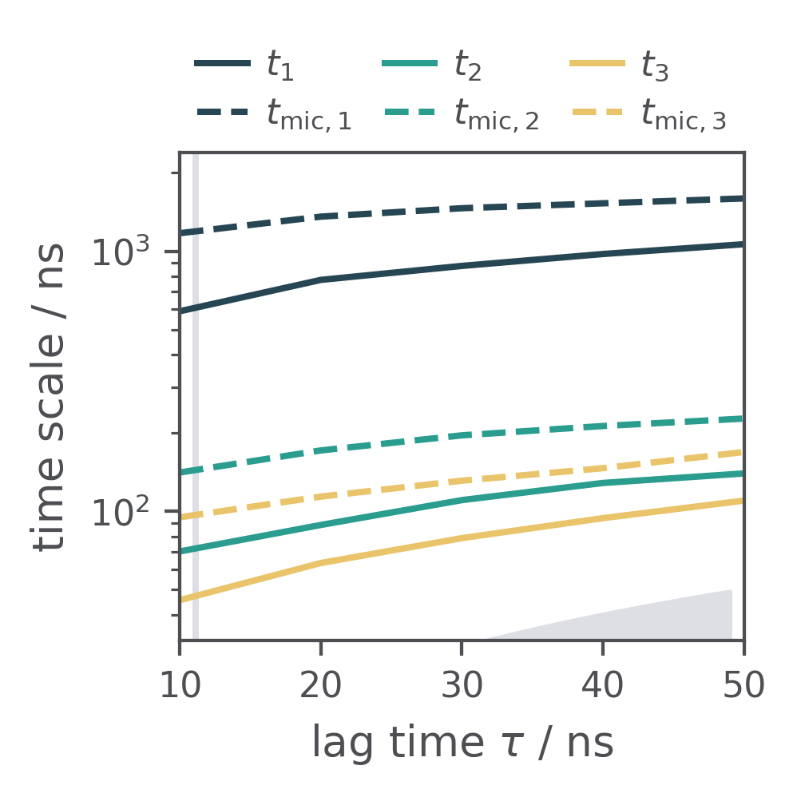

**Example — `KL none` with `T none` macrostate ITS as reference (`use_ref=True`):**

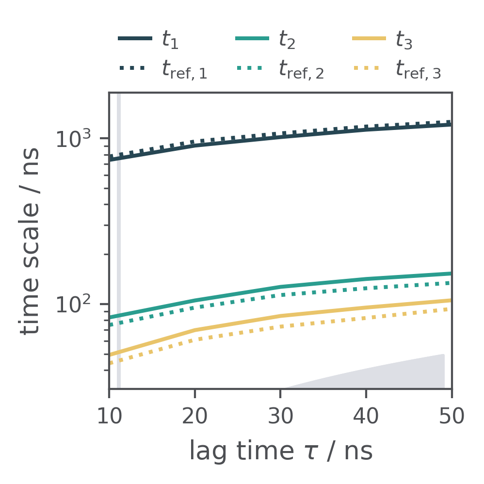

---

## Sankey Diagram

**What it shows:** Microstate flow between the macrostates of the current lumping
(left side) and the reference `T none` lumping (right side). Each horizontal band
represents one macrostate; its thickness is proportional to the number of microstates
it contains. Crossing flows reveal which macrostates split or merge relative to the
reference. Numbers label macrostate indices.

**CLI:**
```bash
python -m MPP.run config.yml KL none -Z Z.npy -p sankey -o sankey.pdf
```

**API:**
```python
mpp.plot.sankey("sankey.pdf")
```

**Example (HP35, `KL none` vs `T none` reference, 14 vs 12 macrostates):**

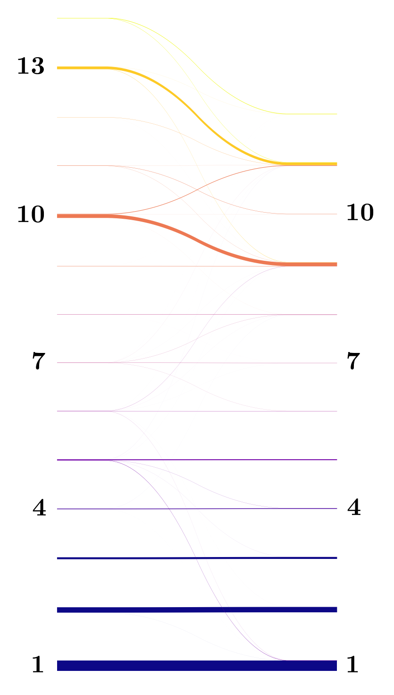

---

## Contact Representation

**What it shows:** Per-macrostate distributions of contact distances grouped by
contact cluster. Each subplot corresponds to one macrostate (labeled with macrostate
index and population percentage). Within each panel the x-axis enumerates contact
clusters, the y-axis shows distances in nm. The dark line is the median; the dark
band is the interquartile range (IQR); the light band extends to \(Q_{1/3} \pm
1.5\,\text{IQR}\). Compact macrostates with small IQR at low distances are
well-folded conformations.

**Requires:** `cluster_file` key in YAML config (contact index file).

**CLI:**
```bash
python -m MPP.run config.yml T none -Z Z.npy -p contacts -o contacts.pdf
```

**API:**
```python
mpp.plot.contact_rep("path/to/cluster_file", "contacts.pdf")
```

**Example (HP35, `T none`, 12 macrostates):**

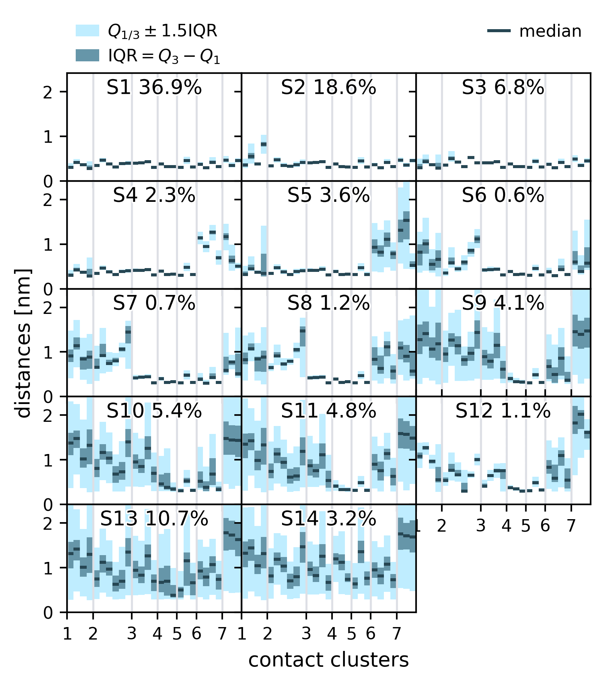

---

## Macrostate Trajectory

**What it shows:** The macrostate trajectory as a color-coded time series. Each tick
mark represents one frame, colored by macrostate index (colorbar on the right). The
trajectory is split into equal-length rows to make long simulations readable. Dense
horizontal bands of the same color indicate persistent, metastable macrostates; rapid
color alternation indicates fast transitions.

**CLI:**
```bash
python -m MPP.run config.yml T none -Z Z.npy -p macrotraj -o macrotraj.pdf
```

**API:**
```python
mpp.plot.macrostate_trajectory("macrotraj.pdf")
```

**Example (HP35, `T none`, 12 macrostates, ~60 µs):**

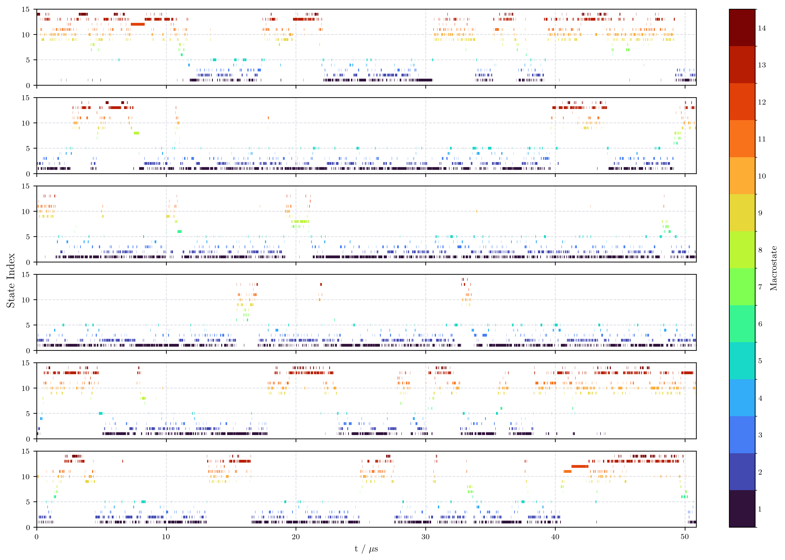

---

## Chapman-Kolmogorov Test

**What it shows:** Chapman-Kolmogorov (CK) test for each macrostate. Each subplot
shows the self-transition probability \(P_{i \to i}(t)\) as a function of time.
The dashed curve is estimated directly from MD data at each time point; the solid
curve is obtained by propagating the macrostate transition matrix raised to
successive powers. Close agreement between the two curves supports the Markov
property of the lumping. Discrepancies at short times indicate residual
non-Markovian behavior.

**CLI:**
```bash
python -m MPP.run config.yml T none -Z Z.npy -p ck_test -o ck_test.pdf
```

**API:**
```python
mpp.plot.ck_test("ck_test.pdf")
```

**Example (HP35, `T none`, 12 macrostates):**

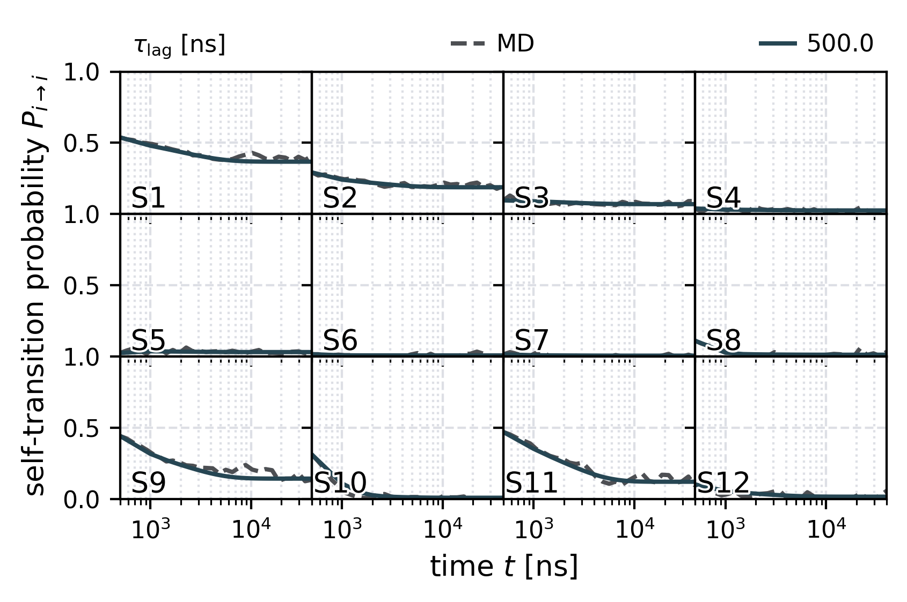

---

## RMSD

**What it shows:** Per-residue C\(\alpha\) RMSD of each macrostate relative to its
own mean structure, plotted on a log scale. Each row corresponds to one macrostate.
The left panel shows RMSD variance per residue (dark area); the right panels show
the macrostate population and the sum of RMSD across all residues as bar charts.
Compact, well-defined macrostates show uniformly low RMSD across all residues.

**Requires:** Topology (`.pdb`) and trajectory (`.xtc`) files set on the `Lumping`
object.

**CLI:**
```bash
python -m MPP.run config.yml T none -Z Z.npy -p rmsd -o rmsd.pdf
```

**API:**
```python
mpp.topology_file = "structure.pdb"
mpp.xtc_trajectory_file = "trajectory.xtc"
mpp.plot.rmsd("rmsd.pdf")
```

**Example (HP35, `T none`, 12 macrostates):**

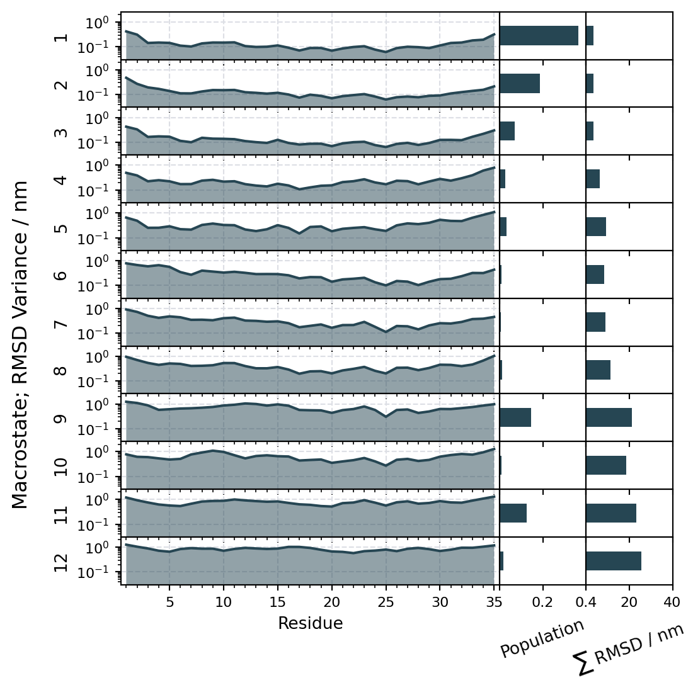

---

## Delta RMSD

**What it shows:** Per-residue C\(\alpha\) RMSD of each macrostate relative to the
mean structure of **macrostate 1** (instead of each state's own mean). Macrostate 1
therefore appears flat near zero; other macrostates show deviations at residues that
differ structurally from macrostate 1. Useful for identifying which parts of the
chain drive the conformational differences between macrostates.

**Requires:** Same as RMSD above.

**CLI:**
```bash
python -m MPP.run config.yml T none -Z Z.npy -p delta_rmsd -o delta_rmsd.pdf
```

**API:**
```python
mpp.plot.delta_rmsd("delta_rmsd.pdf")
```

**Example (HP35, `T none`, 12 macrostates):**

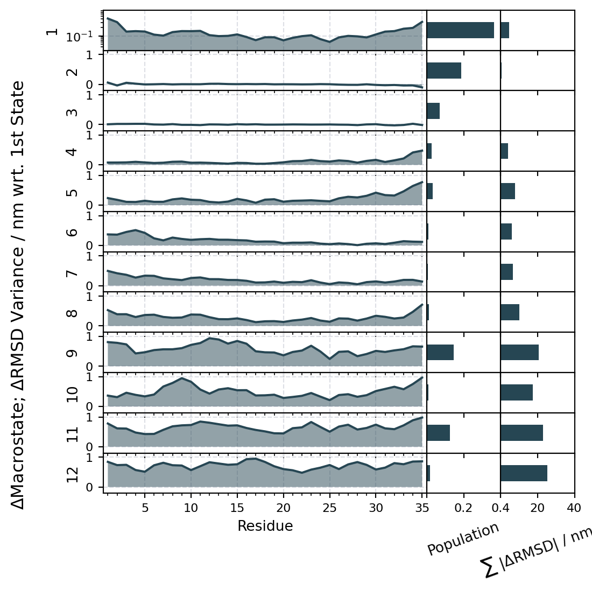

---

## State Network

**What it shows:** A graph of macrostates as labeled nodes, with edges connecting
pairs of macrostates that exchange probability. Edge width is proportional to the
transition probability. Node size reflects macrostate population and node color
follows the same color scheme used in the dendrogram and trajectory plots. Thick
edges between large nodes reveal the main kinetic pathways.

**CLI:**
```bash
python -m MPP.run config.yml T none -Z Z.npy -p state_network -o state_network.pdf
```

**API:**
```python
mpp.plot.state_network("state_network.pdf")
```

**Example (HP35, `T none`, 12 macrostates):**

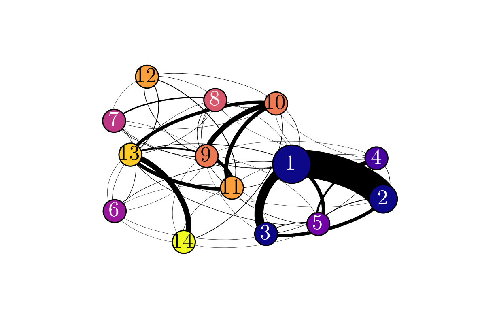

---

## Transition Matrix

**What it shows:** The macrostate transition matrix as a heatmap with percentage
labels. Off-diagonal entries use a logarithmic color scale (teal–yellow); diagonal
self-transition probabilities use a separate linear color scale (white–red) on the
right colorbar. Entries below a threshold are shown as white (gray background).
The pattern of non-zero off-diagonal entries reveals which macrostates communicate
directly at the chosen lag time.

**CLI:**
```bash
python -m MPP.run config.yml T none -Z Z.npy -p transition_matrix -o tmat.pdf
```

**API:**
```python
mpp.plot.transition_matrix("tmat.pdf")
```

**Example (HP35, `T none`, 12 macrostates):**

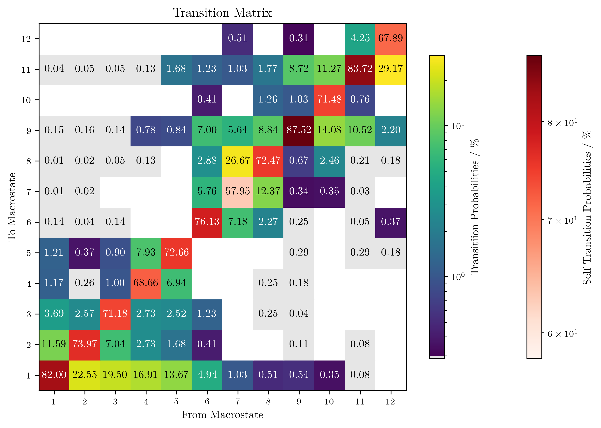

---

## Transition Time

**What it shows:** Mean first-passage times \(t_\text{lag}/P_{ij}\) between
macrostates in nanoseconds, displayed as a heatmap with numerical labels. The
off-diagonal colorbar uses a log scale; the diagonal self-transition times use a
separate linear scale. Gray cells indicate pairs with transition probability below
the threshold. Short transition times between two macrostates indicate fast,
frequent interconversion.

**CLI:**
```bash
python -m MPP.run config.yml T none -Z Z.npy -p transition_time -o transition_time.pdf
```

**API:**
```python
mpp.plot.transition_time("transition_time.pdf")
```

**Example (HP35, `T none`, 12 macrostates):**

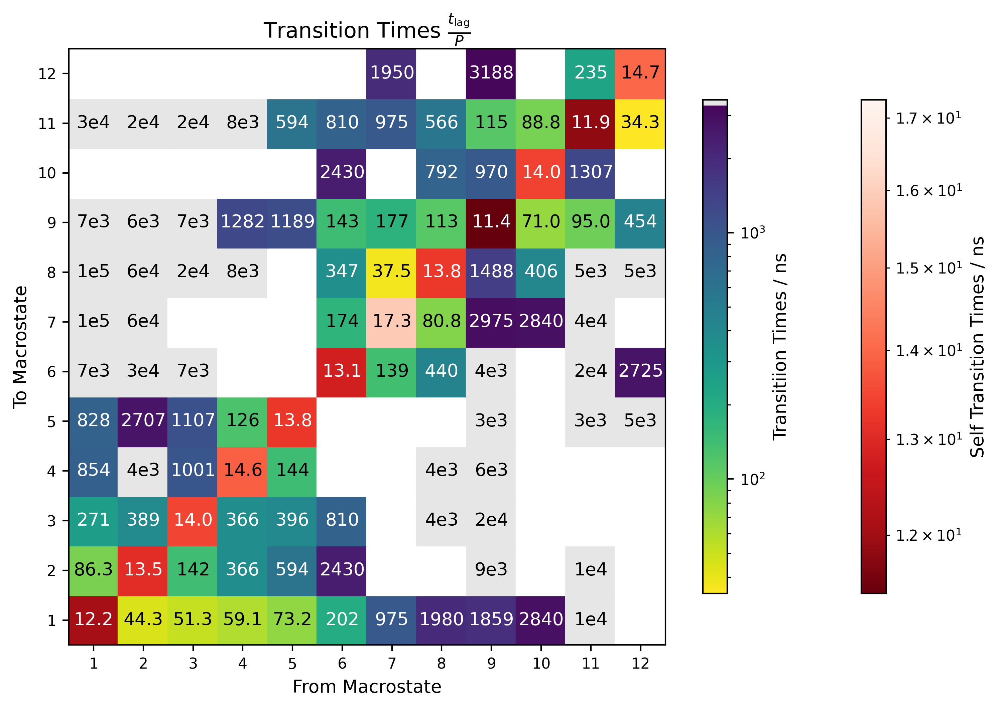

---

## Macrostate Trajectory (text output)

**What it produces:** Not a plot — writes the macrostate trajectory as a plain-text
file (one integer per line, 1-based macrostate indices).

**CLI:**
```bash
python -m MPP.run config.yml T none -Z Z.npy \
    -p macrostate_trajectory -o macrostate_trajectory.txt
```

**API:**
```python
mpp.save_macrostate_trajectory("macrostate_trajectory.txt", one_based=True)
```

---

## Stochastic State Similarity

**What it shows:** For each macrostate of the reference `T none` lumping, a
histogram of similarity scores over all stochastic runs. Three overlap measures
are compared: *lumping* (fraction of the stochastic macrostate that matches the
reference state), *reference* (fraction of the reference state covered by the
stochastic macrostate), and *union* (Jaccard index). High similarity scores
concentrated near 1.0 for all measures indicate that the stochastic runs
consistently recover the same macrostates as the deterministic reference.

Only meaningful for `n_runs > 1`.

**CLI:**
```bash
python -m MPP.run config_stochastic.yml T none -Z Z.npy \
    -p stochastic_state_similarity -o state_similarity.pdf
```

**API:**
```python
mpp.plot.stochastic_state_similarity("state_similarity.pdf")
```

**Example (HP35, `T none` stochastic, 10 runs):**

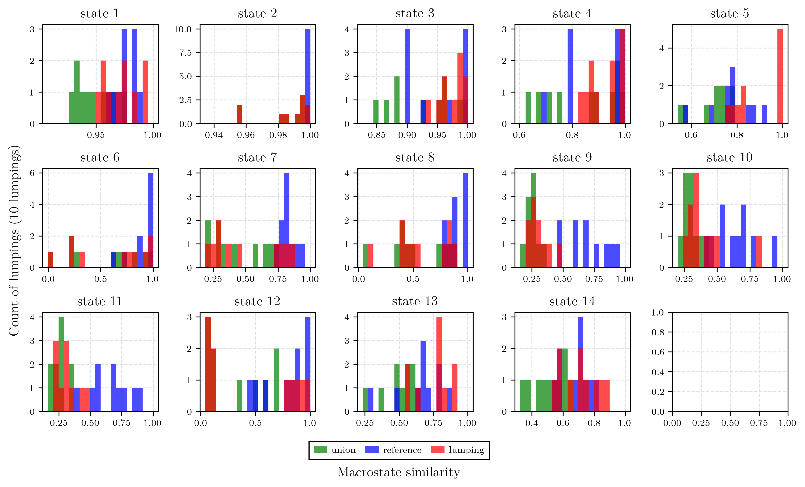

---

## Relative Implied Timescales

**What it shows:** Three panels summarizing the distribution of implied timescales
across stochastic runs relative to the deterministic reference lumping. The left
panel shows the distribution of the slowest relative timescale
\(t_\text{stoch} / t_\text{ref}\) for ITS 1; the middle panel shows the mean
over all computed timescales; the right panel shows the distribution of macrostate
counts across runs. Values close to 1.0 in the timescale panels indicate that the
stochastic lumping preserves the slow dynamics of the reference.

Only meaningful for `n_runs > 1`.

**CLI:**
```bash
python -m MPP.run config_stochastic.yml T none -Z Z.npy \
    -p relative_implied_timescales -o rel_timescales.pdf
```

**API:**
```python
mpp.plot.relative_implied_timescales("rel_timescales.pdf")
```

**Example (HP35, `T none` stochastic, 10 runs):**

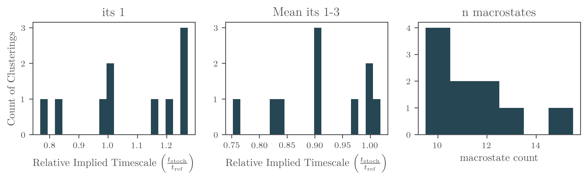

---

## Macro Feature

**What it shows:** A histogram of the population-weighted mean feature value
(fraction of native contacts) across all microstates assigned to each macrostate,
pooled over all stochastic runs (dark bars). Red vertical lines mark the positions
of the reference macrostate feature values (scaled by 1/1000 for visibility), with
macrostate labels. The spread of each cluster of bars around the corresponding red
line indicates how consistently the stochastic runs place the same microstates into
each macrostate.

Only meaningful for `n_runs > 1`.

**CLI:**
```bash
python -m MPP.run config_stochastic.yml T none -Z Z.npy \
    -p macro_feature -o macro_feature.pdf
```

**API:**
```python
mpp.plot.macro_feature("macro_feature.pdf")
```

**Example (HP35, `T none` stochastic, 10 runs):**

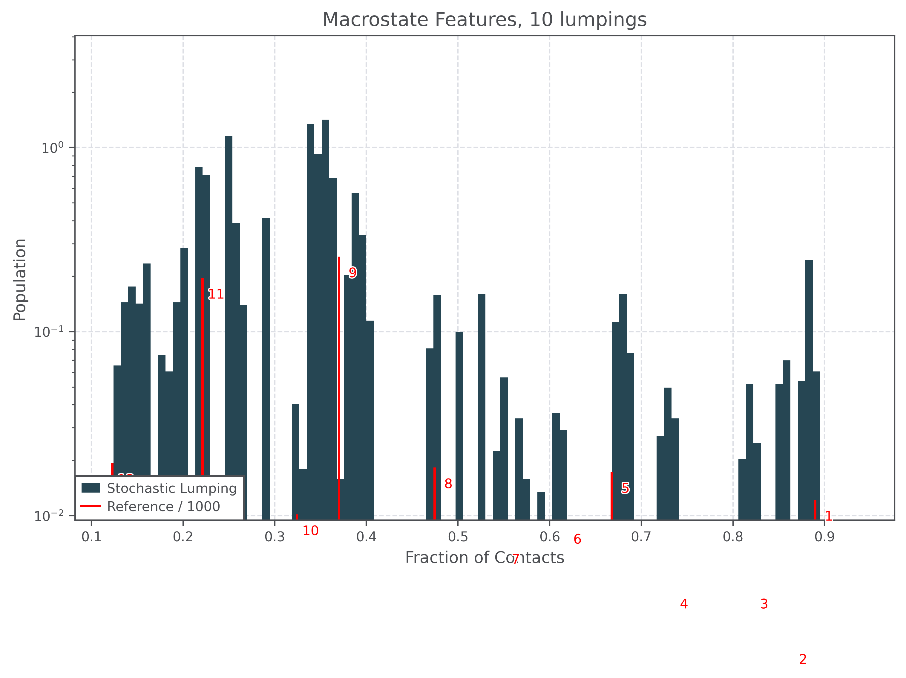
